### Sveučilište Jurja Dobrile u Puli

### Prijediplomski sveučilišni studij Informatika

# Projektna dokumentacija: Image Quiz

**Ime i prezime studenta:** Igor Pavlić  
**JMBAG:** 0069012453  


**7. rujna 2025.**


## 1. Sažetak

Ovaj rad predstavlja projektnu dokumentaciju za web aplikaciju "Image Quiz" razvijenu u Vue.js tehnologiji. Aplikacija predstavlja edukativnu platformu koja kombinira umjetnu inteligenciju i gamifikaciju u svrhu učenja engleskih riječi. Sustav omogućava korisnicima pogađanje riječi na temelju AI-generiranih slika, praćenje napretka kroz bodovni sustav te natjecanje s drugim korisnicima. Implementacija uključuje Firebase autentifikaciju, Firestore bazu podataka te integraciju s DeepAI API servisom. Aplikacija razlikuje tri razine korisničkih privilegija: gost, registrirani korisnik i administrator, pri čemu svaka razina ima definirane funkcionalnosti.

## 2. Uvod

Tradicionalne metode učenja riječi često se oslanjaju na mehaničko memoriranje koje ne potiče dugoročno zadržavanje znanja. Istraživanja pokazuju da vizualno učenje značajno poboljšava retenciju informacija, posebno kada je kombinirano s interaktivnim elementima.

Image Quiz aplikacija razvija se kao odgovor na potrebu za modernijim pristupom učenju. Ciljano tržište obuhvaća obrazovne institucije, samostalne učenike te sve koji žele poboljšati svoj vokabular kroz interaktivnu metodu. Aplikacija se oslanja na moderne web tehnologije što omogućava pristup s bilo kojeg uređaja s internetskom vezom, bez potrebe za instalacijom.

Glavne prednosti ovog rješenja uključuju automatsko generiranje vizualnog sadržaja pomoću umjetne inteligencije, što eliminira potrebu za ručnim stvaranjem materijala. Sustav bodovanja i highscore lista uvode element natjecanja koji povećava motivaciju korisnika. Firebase backend osigurava skalabilnost i pouzdanost sustava.

## 3. Motivacija

### 3.1 Analiza tržišta

Trenutno tržište edukativnih aplikacija dominiraju platforme poput Duolingo, Memrise i Quizlet. Međutim, analiza postojećih rješenja pokazuje nedostatak aplikacija koje kombiniraju AI-generirane vizualne elemente s učenjem riječi.

Quizlet omogućava stvaranje flashcard setova ali zahtijeva ručno dodavanje slika. Memrise kombinira vizualne elemente ali ne koristi AI tehnologiju za dinamičko generiranje sadržaja.

### 3.2 SWOT analiza

**Snage:**
- Kombinacija AI tehnologije i obrazovnog sadržaja
- Automatsko generiranje slika eliminira potrebu za ručnim radom
- Firebase infrastruktura omogućava skalabilnost bez velikih početnih investicija
- Jednostavno korisničko sučelje prilagođeno svim dobnim skupinama
- Real-time sinkronizacija podataka između korisnika

**Slabosti:**
- Ovisnost o vanjskom API servisu (DeepAI) predstavlja potencijalni point of failure
- Kvaliteta generiranih slika ovisi o AI modelu koji se kontinuirano mijenja
- Ograničen broj besplatnih API poziva mjesečno
- Aplikacija zahtijeva stalnu internetsku vezu

**Prilike:**
- Rastući trend digitalizacije u obrazovanju, posebno nakon pandemije
- Mogućnost proširenja na više jezika i predmetnih područja
- Potencijal za B2B suradnju s obrazovnim institucijama
- Integracija s postojećim LMS sustavima

**Prijetnje:**
- Ulazak velikih tech kompanija na tržište edukativnih aplikacija
- Promjene u cijenama API servisa mogu učiniti projekt neisplativim
- Brz razvoj AI tehnologije može učiniti trenutno rješenje zastarjelim
- GDPR i drugi regulatorni zahtjevi za aplikacije koje rade s djecom

### 3.3 Predispozicije za implementaciju

Za uspješno uvođenje aplikacije potrebno je osigurati:
- Stabilan web hosting s HTTPS certifikatom
- Firebase projekt s aktiviranim Authentication i Firestore servisima
- DeepAI API ključ s dovoljnim brojem kredita
- Minimalno jedan administrator za upravljanje sadržajem

### 3.4 Dionici sustava

Koristi od aplikacije imaju:
- **Učenici/studenti**: poboljšanje vokabulara kroz zabavnu metodu učenja
- **Obrazovne institucije**: moderna nastavna pomagala bez dodatnih troškova
- **Roditelji**: alat za pomoć djeci u učenju

## 4. Razrada funkcionalnosti

### 4.1 Skupine korisnika i njihove privilegije

Sustav razlikuje tri razine korisnika:

**Gost (neautentificirani korisnik):**
- Pregled početne stranice
- Registracija novog računa
- Prijava postojećim računom

**Igrač (autentificirani korisnik):**
- Igranje kviza
- Pregled osobnih rezultata
- Pregled highscore liste
- Odjava iz sustava

**Administrator (vlasnik sustava):**
- Sve funkcionalnosti igrača
- Dodavanje novih riječi u bazu
- Brisanje postojećih riječi
- Pregled statistike korištenja

### 4.2 Use Case dijagram

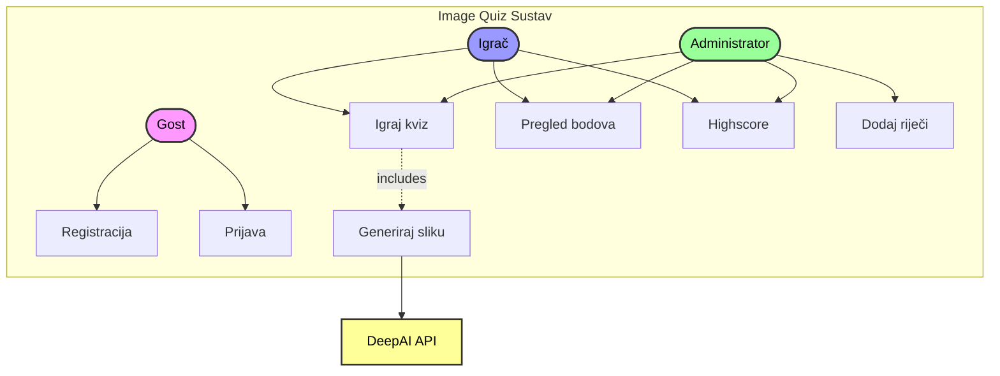

### 4.3 Komunikacija s vanjskim sustavima

Aplikacija komunicira s dva vanjska sustava:

**Firebase (Google):**
- Authentication za upravljanje korisnicima
- Firestore za pohranu podataka
- Komunikacija putem Firebase SDK-a

**DeepAI:**
- Text-to-image API za generiranje slika
- REST API komunikacija
- Autentifikacija putem API ključa

### 4.4 Ključni korisnički scenarij - Igranje kviza

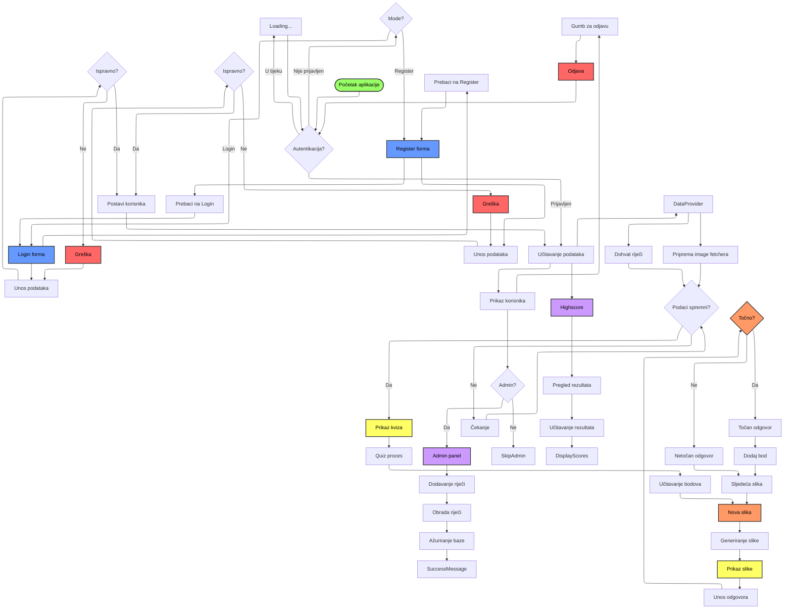

### 4.5 Prototip sučelja

**Početni ekran (Login.vue):**
- Minimalistički dizajn s fokusom na funkcionalnost
- Polja za email i lozinku
- Gumbovi za prijavu i registraciju
- Toggle između Login i Register modova

**Glavni ekran (QuizView.vue):**
- Centrirana slika generirana od AI-ja
- Polje za unos odgovora
- Prikaz trenutnih bodova
- Vizualna povratna informacija (✅/❌)

**Admin panel:**
- Tekstualno polje za unos riječi
- Gumb za dodavanje
- Lista trenutnih riječi

**Highscore lista:**
- Top 10 igrača
- Označavanje trenutnog korisnika
- Prikaz dodatnog ranga ako korisnik nije u top 10

### 4.6 Class dijagram

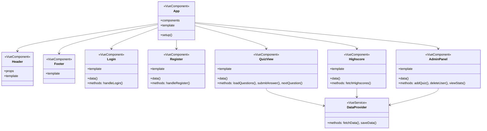

## 5. Implementacija

### 5.1 Arhitektura aplikacije

Aplikacija koristi komponentnu arhitekturu Vue.js frameworka s jasno definiranom hijerarhijom:

```
App.vue (root komponenta)
├── Header.vue (naslov aplikacije)
├── Auth komponente
│   ├── Login.vue (prijava korisnika)
│   └── Register.vue (registracija)
├── DataProvider.vue (podatkovni sloj)
├── QuizView.vue (glavna logika igre)
├── AdminPanel.vue (admin funkcionalnosti)
├── Highscore.vue (prikaz rezultata)
└── Footer.vue (copyright informacije)
```

### 5.2 Ključna funkcionalnost - Generiranje i provjera kviza

Implementacija kviza odvija se kroz nekoliko povezanih komponenti:

**DataProvider.vue** služi kao centralni podatkovni sloj:
- Dohvaća riječi iz Firestore baze
- Upravlja komunikacijom s DeepAI API-jem
- Emitira događaje prema parent komponenti

**QuizView.vue** implementira glavnu logiku:
```javascript
class QuizView {
  // Props
  - wordList: Array<string>
  - fetchImage: Function
  
  // Data
  - imageUrl: string
  - correctWord: string
  - userAnswer: string
  - result: string
  - score: number
  - isLoading: boolean
  
  // Methods
  + loadScore(): Promise<void>
  + loadNewImage(): Promise<void>
  + checkAnswer(): Promise<void>
  + handleEnterPress(): void
}
```

### 5.3 Firebase integracija

```javascript
class FirebaseService {
  // Konfiguracija
  - config: FirebaseConfig
  - auth: Auth
  - db: Firestore
  
  // Auth metode
  + signInWithEmailAndPassword()
  + createUserWithEmailAndPassword()
  + signOut()
  + onAuthStateChanged()
  
  // Firestore metode
  + collection()
  + doc()
  + getDocs()
  + setDoc()
  + updateDoc()
  + addDoc()
}
```

### 5.4 Popis komponenti i njihovih funkcionalnosti

| Komponenta | Funkcionalnost | Ulazni parametri | Emitira |
|------------|---------------|------------------|---------|
| Login.vue | Prijava korisnika | - | authenticated, toggle |
| Register.vue | Registracija | - | authenticated, toggle |
| DataProvider.vue | Dohvaćanje podataka | - | wordsLoaded, imageFetcherReady |
| QuizView.vue | Glavni kviz | wordList, fetchImage | - |
| AdminPanel.vue | Admin panel | - | refresh |
| Highscore.vue | Prikaz rezultata | - | - |
| Header.vue | Naslov | - | - |
| Footer.vue | Podnožje | - | - |

## 6. Korisničke upute

### 6.1 Registracija i prva prijava

Pri prvom pokretanju aplikacije prikazuje se ekran za prijavu. 

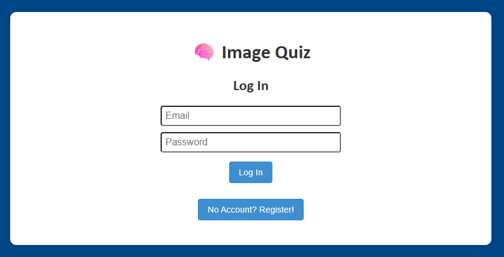

Novi korisnici trebaju:

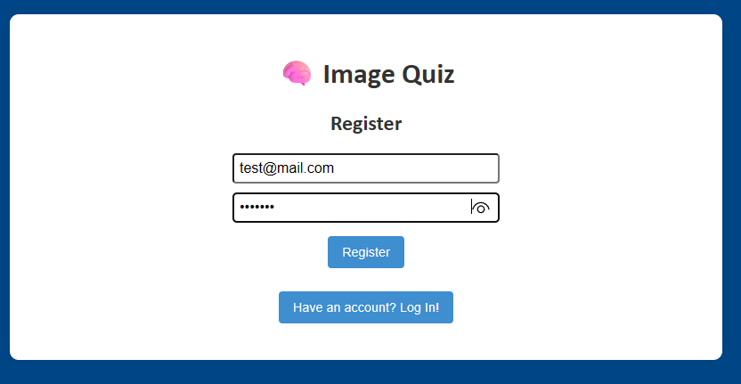

1. Kliknuti na "No Account? Register!"
2. Unijeti važeću email adresu
3. Unijeti lozinku (minimalno 6 znakova)
4. Kliknuti "Register"
5. Sustav automatski prijavljuje korisnika

### 6.2 Igranje kviza

Nakon uspješne prijave, kviz se automatski učitava:

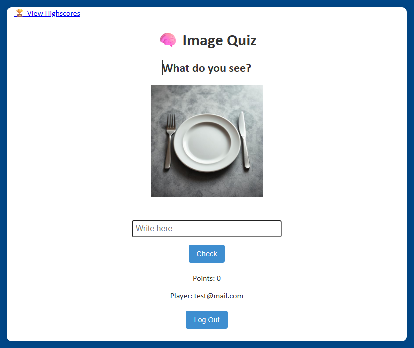

1. **Pričekajte generiranje slike** - prikazuje se "Generating image..." poruka
2. **Analizirajte sliku** - pokušajte prepoznati što slika predstavlja
3. **Unesite odgovor** - upišite riječ u polje "Write here"
4. **Potvrdite odgovor** - kliknite "Check"
5. **Provjerite rezultat**:
   - ✅ Correct! - dodaje se 1 bod
   - ❌ Wrong. Correct answer: [riječ] - nema bodova
  


6. **Nova runda** - automatski se učitava nakon 1 sekunde

### 6.3 Pregled rezultata

Highscore lista dostupna je klikom na "🏆 View Highscores":

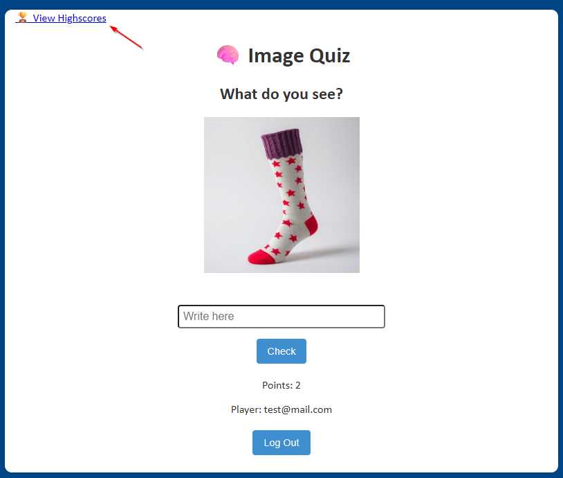

- Prikazuje top 10 igrača
- Vaš rezultat označen je drugom bojom
- Ako niste u top 10, vaš rang prikazuje se na dnu
- Lista se automatski osvježava

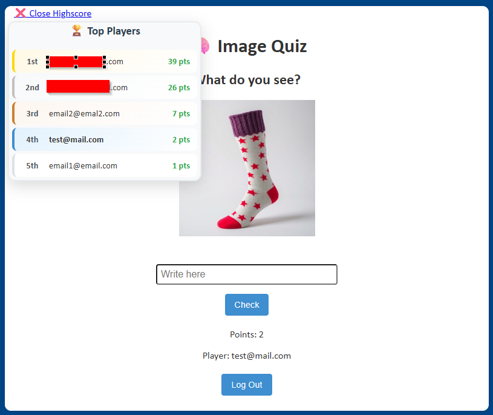

### 6.4 Administratorske funkcije

Samo korisnik s email adresom koju postavimo u aplikaciji ima pristup admin panelu:

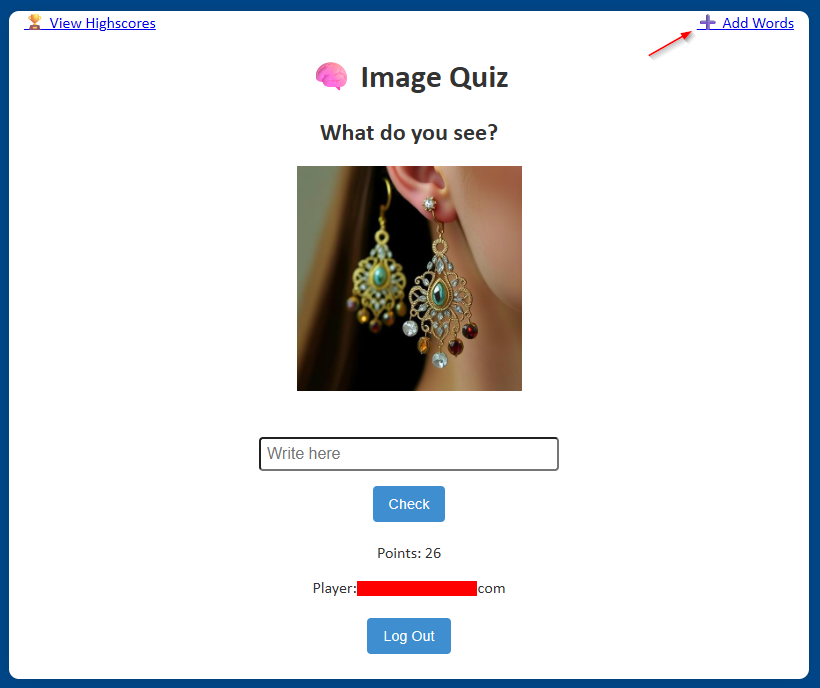

1. **Otvaranje panela** - klik na "➕ Add Words"
2. **Unos riječi** - upisati riječi odvojene zarezom ili razmakom
3. **Potvrda** - klik na "Add Words"
4. **Provjera** - pojavljuje se ✅ Words Added!

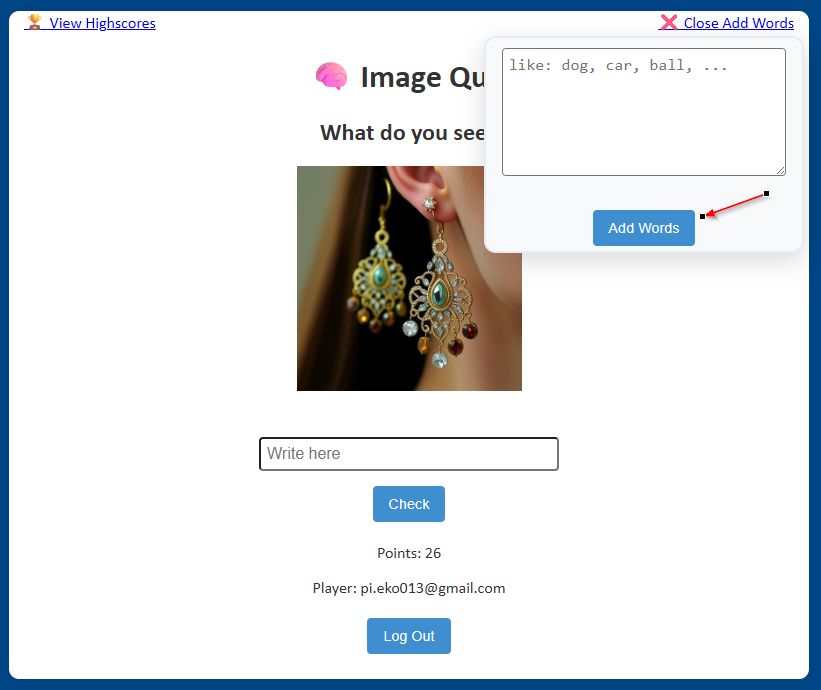

Sustav automatski:
- Pretvara sve riječi u mala slova
- Uklanja duplikate
- Ignorira riječi kraće od 2 slova

### 6.6 Odjava iz sustava

Za odjavu jednostavno kliknite gumb "Log Out" na dnu ekrana. Sustav će vas vratiti na ekran za prijavu.

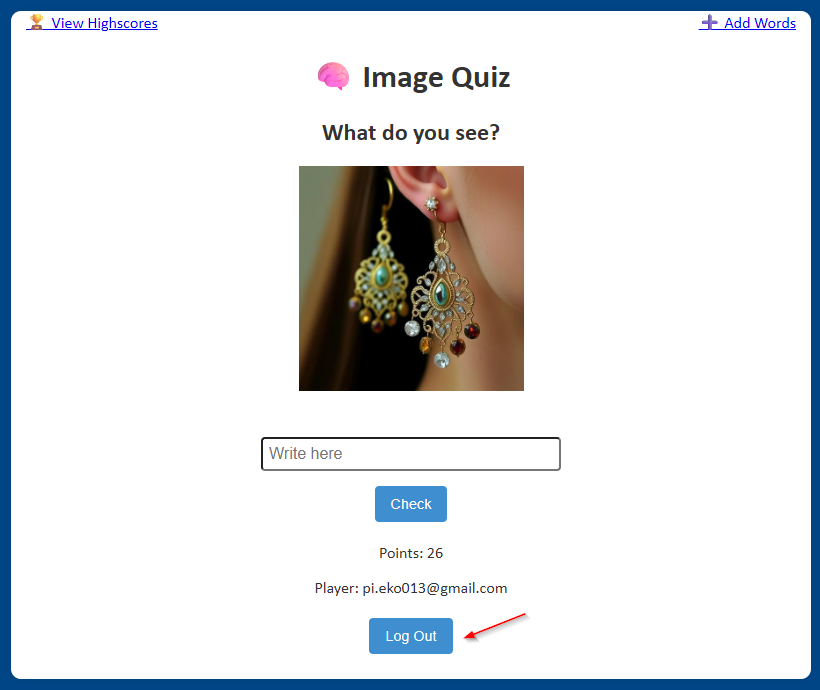


