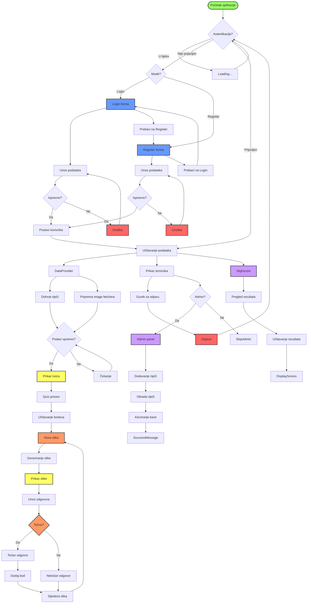

# Dokumentacija slučajeva korištenja - Image Quiz

## 1. Pregled aplikacije

Image Quiz je web aplikacija koja testira sposobnost korisnika da prepoznaju sliku koja predstavlja zadanu riječ. Aplikacija koristi Firebase za autentikaciju i pohranu podataka, te DeepAI API za generiranje slika na temelju tekstualnih upita.

## 2. Dionici (stakeholders)

- **Igrači** - korisnici koji rješavaju kviz
- **Administrator** - korisnik s posebnim privilegijama za upravljanje riječima
- **Vlasnik** - korisnik koji ima email "pi.eko013@gmail.com" i ima administratorske ovlasti

## 3. Glavni slučajevi korištenja

### 3.1. Autentikacija korisnika

#### 3.1.1. Prijava (Login)
- **Akter**: Igrač
- **Preduvjet**: Korisnik ima kreiran korisnički račun
- **Tijek**:
  1. Korisnik unosi email i lozinku
  2. Korisnik klikće na gumb "Log In"
  3. Sustav provjerava ispravnost podataka
  4. Sustav prijavljuje korisnika u aplikaciju
- **Alternativni tijek**:
  - Ako su podaci neispravni, prikazuje se poruka o pogrešci
  - Korisnik može kliknuti "No Account? Register!" za prelazak na registraciju

#### 3.1.2. Registracija (Register)
- **Akter**: Igrač
- **Preduvjet**: Korisnik nema kreiran korisnički račun
- **Tijek**:
  1. Korisnik unosi email i lozinku
  2. Korisnik klikće na gumb "Register"
  3. Sustav kreira novi korisnički račun
  4. Sustav automatski prijavljuje korisnika u aplikaciju
- **Alternativni tijek**:
  - Ako email već postoji ili je lozinka neodgovarajuća, prikazuje se poruka o pogrešci
  - Korisnik može kliknuti "Have an account? Log In!" za prelazak na prijavu

#### 3.1.3. Odjava (Logout)
- **Akter**: Igrač
- **Preduvjet**: Korisnik je prijavljen
- **Tijek**:
  1. Korisnik klikće na gumb "Log Out"
  2. Sustav odjavljuje korisnika iz aplikacije
  3. Korisnik se vraća na zaslon za prijavu

### 3.2. Igranje kviza

#### 3.2.1. Prepoznavanje slike
- **Akter**: Igrač
- **Preduvjet**: Korisnik je prijavljen i aplikacija je učitala popis riječi
- **Tijek**:
  1. Sustav nasumično odabire riječ iz baze
  2. Sustav generira sliku koja predstavlja odabranu riječ pomoću DeepAI API-ja
  3. Sustav prikazuje generiranu sliku korisniku
  4. Korisnik unosi svoj odgovor
  5. Korisnik potvrđuje odgovor pritiskom na gumb "Check" ili tipku Enter
  6. Sustav provjerava točnost odgovora
  7. Sustav prikazuje rezultat (točno/netočno)
  8. Nakon kratke pauze, sustav učitava novu sliku i riječ
- **Alternativni tijek**:
  - Ako korisnik ne unese odgovor, prikazuje se upozorenje

#### 3.2.2. Osvajanje bodova
- **Akter**: Igrač
- **Preduvjet**: Korisnik je točno odgovorio na pitanje
- **Tijek**:
  1. Sustav povećava broj bodova korisnika za 1
  2. Sustav ažurira prikaz bodova
  3. Sustav ažurira bodove u bazi podataka

### 3.3. Pregled ljestvice najboljih rezultata

#### 3.3.1. Pregledavanje rezultata
- **Akter**: Igrač
- **Preduvjet**: Korisnik je prijavljen
- **Tijek**:
  1. Korisnik klikće na "View Highscores"
  2. Sustav dohvaća i prikazuje prvih 10 igrača poredanih prema broju bodova
  3. Ako je trenutni korisnik izvan prvih 10, prikazuje se i njegova pozicija

### 3.4. Administratorske funkcije

#### 3.4.1. Dodavanje novih riječi
- **Akter**: Administrator (vlasnik)
- **Preduvjet**: Korisnik je prijavljen i ima email "pi.eko013@gmail.com"
- **Tijek**:
  1. Administrator klikće na "Add Words"
  2. Sustav prikazuje formu za unos riječi
  3. Administrator unosi riječi odvojene zarezima ili razmacima
  4. Administrator potvrđuje unos klikom na gumb "Add Words"
  5. Sustav filtrira riječi, uklanja duplikate i dodaje ih u bazu podataka
  6. Sustav prikazuje potvrdu uspješnog dodavanja

## 4. Tehničke specifikacije

### 4.1. Korištene tehnologije
- Vue.js 3 (Composition API)
- Firebase (Authentication, Firestore)
- DeepAI API za generiranje slika

### 4.2. Struktura podataka

#### 4.2.1. Kolekcija "words"
- Sadrži riječi koje se koriste za generiranje slika
- Struktura dokumenta:
  - `word`: String - riječ koja se koristi za kviz

#### 4.2.2. Kolekcija "users"
- Sadrži podatke o korisnicima i njihovim rezultatima
- Struktura dokumenta:
  - `email`: String - email korisnika
  - `score`: Number - broj bodova koje je korisnik osvojio

## 5. Dijagram toka aplikacije

## 6. Sigurnosne napomene

1. Aplikacija koristi Firebase Authentication za sigurnu autentikaciju korisnika
2. Administratorske funkcije dostupne su samo korisniku s određenim email-om
3. DeepAI API ključ treba čuvati kao environment varijablu (VITE_DEEPAI_API_KEY)
4. Bodovi se ažuriraju samo za autenticirane korisnike

## 7. Moguća unapređenja

1. Implementacija više razina težine
2. Dodavanje vremenskog ograničenja za odgovore
3. Implementacija kategorija riječi
4. Dodavanje mogućnosti za više jezika
5. Implementacija sustava nagrada ili postignuća
6. Dodavanje statistike za korisnike (postotak točnih odgovora, najbrži odgovori, itd.)
7. Implementacija mogućnosti za izazivanje drugih korisnika
